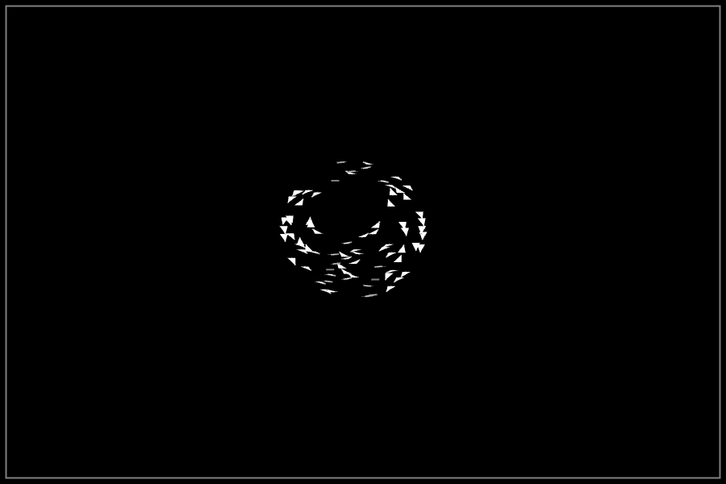

# Boids in Python

An example project, creating [Boids](https://en.wikipedia.org/wiki/Boids) in Python using [The Python Arcade Library](https://api.arcade.academy/en/latest/index.html) entities.

Boids are a way to represent a complex system using a set of simple rules. This project uses the following basic rules.

**Alignment**: steer towards the average heading of local flockmates

**Seperation**:  steer to avoid crowding local flockmates

**Cohesion**: steer to move towards the average position (center of mass) of local flockmates

### Setup

1. Install the required packages

`pip3 install -r requirements.txt`

2. Run main

`python3 main.py`